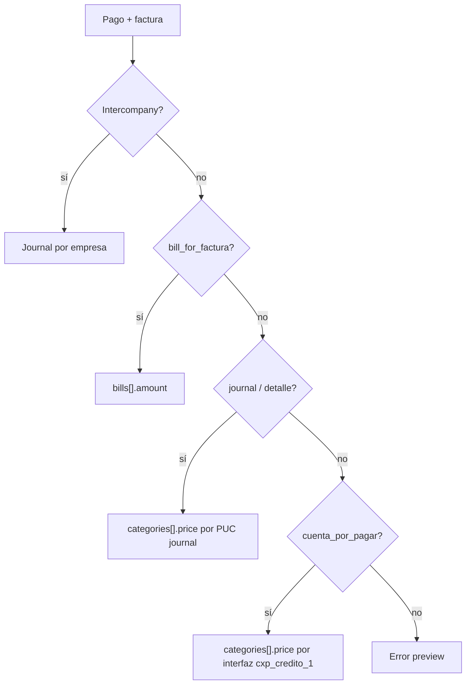

# Integración Alegra

Documentación del módulo `alegra_integration` y flujos relacionados en `accounting`. Pensada para operadores y **agentes de código** que mantengan o extiendan la integración.

## Guía rápida para agentes

| Tema | Dónde leer | Archivos clave |
|------|------------|----------------|
| Preview / envío / lotes | [Flujo Preview](#flujo-preview), [Flujo Send](#flujo-send), [Dashboard](#dashboard-ui) | `services.py`, `views.py` |
| Mapeos empresa/proyecto | [Mapeos esperados](#mapeos-esperados), [MappingResolver](#mappingresolver) | `mapping.py`, `models.py` |
| Egresos `POST /payments` | [Egresos — pagos](#pagos-accountingpagos) | `builders.py` → `ExpensePaymentBuilder` |
| Intercompany | [Intercompany](#pagos-y-transferencias-intercompany) | `builders.py`, `cuentas_intercompanias` |
| Webhooks facturas compra | [Webhooks](#webhooks-facturas-de-compra) | `webhook_bills.py`, `bill_mapping.py`, `bill_pdf.py` |
| Avisos n8n gastos Alegra | [Aprobación gastos Alegra — n8n](#notificaciones-n8n-salientes-gastos-alegra) | `accounting/gasto_n8n_notify.py` |
| Radicado journal CxP | [Radicados y tipos](#radicados-facturas-y-tipos-en-alegra) | `accounting/journal_cxp.py` |
| Recibos (numeración OK) | [Recibos](#recibos-de-caja) | `ReceiptPaymentBuilder` — usa `numberTemplate` |
| Tests | [Comandos](#comandos-de-verificación) | `alegra_integration/tests.py` |

**Reglas que no se deben romper:**

1. Los builders **no** llaman a Alegra; solo arman JSON.
2. Los IDs de Alegra vienen de `AlegraMapping` / `MappingResolver`, no del PUC legacy directo.
3. `local_key` es idempotencia: no cambiar formatos sin migración.
4. Documentos `status=sent` no se reenvían ni se degradan a `valid` en preview.
5. Journals (recibos, intercompany y comisiones internas) usan **`numberTemplate`** (string ID) y `status: open`.
6. `POST /payments` no lleva `amount` en la raíz: el valor va en `bills[].amount` o `categories[].price`.

---

## Objetivo

Reemplazar gradualmente interfaces contables tipo Excel/SIIGO por envío directo a Alegra, **sin eliminar flujos viejos**.

Hay UI interna (Dashboard + Referencias) y API REST bajo `/accounting/alegra/`.

**Documentos cubiertos:**

| Tipo lote (`document_type`) | Fuente | Envío Alegra |
|----------------------------|--------|--------------|
| `receipt` | `Recaudos_general` (BD proyecto) | `POST /journals` |
| `commission` | `Pagocomision` (SP proyecto) | Journal interno / `POST /bills` externo |
| `gtt` | `Gtt` + `Detalle_gtt` (aprobados) | `POST /bills` (documento soporte) |
| `expense` | `Pagos`, `Anticipos`, `transferencias_companias` | `POST /payments`, transfer bancaria, journals interco |

**Idea central:** Alegra usa IDs propios (banco, categoría, contacto, numeración, bill, etc.). El puente es `AlegraMapping` + `MappingResolver`.

---

## Estructura del módulo

```
alegra_integration/
├── models.py              # AlegraMapping, AlegraSyncBatch, AlegraDocument, índices, webhooks logs
├── mapping.py             # MappingResolver
├── builders.py            # Payloads por tipo de documento
├── services.py            # preview, send, contact-sync, reference-sync
├── client.py              # AlegraMCPClient (REST api/v1)
├── views.py + urls.py     # Dashboard, referencias, API
├── bill_mapping.py        # Webhook/edit bill → Facturas, tipo bill/journal
├── bill_pdf.py            # GET bill, PDF, enrich
├── webhook_bills.py       # Ingesta new-bill / edit-bill / delete-bill
├── webhook_inbound_status.py
├── pago_link.py           # Pagos.alegra_payment_id tras envío
└── management/commands/
    ├── backfill_alegra_bill_sync.py
    ├── backfill_alegra_journal_detalle.py
    └── backfill_webhook_inbound.py
```

**Accounting relacionado:**

- `accounting/journal_cxp.py` — extracción CxP de journals Alegra, `alegra_journal_detalle`, mapeo PUC→categoría.
- `accounting/gasto_aprobacion*.py` — aprobación gastos webhook.
- Campos en `Facturas`: `alegra_bill_id`, `alegra_document_type`, `alegra_journal_detalle`, …
- Campos en `Pagos`: `alegra_payment_id` (migración `0086`).

---

## Puntos de entrada

Base: `/accounting/alegra/`

### UI

| Ruta | Uso |
|------|-----|
| `GET /` | Dashboard: preview, enviar, tabla documentos, historial lotes |
| `GET /references` | Mapeos bancos, categorías, numeraciones, interfaces CxP, intercompany, GTT, recibos, comisiones |

### Operación (JSON + sesión)

| Método | Ruta | Descripción |
|--------|------|-------------|
| `POST` | `/preview` | Construye lote + documentos (`status=preview`) |
| `POST` | `/send` | Preview + envío en una llamada |
| `GET` | `/batches/` | Historial lotes |
| `GET` | `/batches/<id>` | Detalle lote + documentos |
| `POST` | `/batches/<id>/send` | Envía lote ya en preview **sin reconstruir** |
| `POST` | `/reference-sync` | Sincroniza catálogos Alegra → cache/UI |

Payload preview/send:

```json
{
  "empresa": "901018375",
  "proyecto": "Oasis",
  "document_type": "expense",
  "fecha_desde": "2026-05-01",
  "fecha_hasta": "2026-05-08"
}
```

- `proyecto` **obligatorio** para `receipt` y `commission`.
- `expense` opera por **empresa** (`Pagos.empresa`, transferencias donde la empresa es `sale` o `entra`).

Tipos: `receipt` | `commission` | `gtt` | `expense`.

### Referencias (API)

- `GET /references/data?empresa=&type=banks|categories|cost_centers|number_templates|retentions|journal_numerations`
- `POST /references/save-retention-mapping` — retenciones (p. ej. `commission_retefuente`)
- `GET /references/mappings?...`
- `GET /references/local-accounts?empresa=`
- `POST /references/save-bank-mapping`
- `POST /references/save-category-mapping`
- `POST /references/save-numeration-mapping`
- `GET /references/categories/search?empresa=&q=`
- `GET /references/interfaces?empresa=` — `info_interfaces` → CxP / anticipos
- `GET /references/intercompany?empresa=` — `cuentas_intercompanias`

### Contactos

- `POST /contact-sync` — progresivo con cache
- `POST /contact-link` — enlace manual local ↔ Alegra
- `GET /contact-link/lookup-local`, `/contact-link/validate-alegra`
- `POST /contacts/bulk-create-from-batch`, `/contacts/missing-in-alegra-from-batch`

### Debug

- `GET /debug/mapping-check?...` — comprobar resolución de un mapeo

---

## Dashboard UI

Tras **Preview**, el resumen del lote (`batch.summary`) distingue:

| Campo | Significado |
|-------|-------------|
| `total_documents` | Filas en el lote |
| `ready_to_send` | `status=valid` — se enviarán |
| `already_sent` | `status=sent` — solo informativo |
| `built_ok` | `ready_to_send + already_sent` |
| `invalid` | Errores de mapeo/datos |

**Optimización:** si ya existe `AlegraDocument` `sent` para la misma `empresa` + `source_model` + `source_pk`, el preview **no ejecuta el builder** (no resuelve mapeos ni arma payload); solo reasocia el documento al lote.

Métricas en pantalla (modo preview):

- **Listos para enviar** = `ready_to_send`
- **Ya enviados** = `already_sent` (no se reconstruyen ni reenvían)
- **Inválidos** = errores

Modal de confirmación de envío muestra cuántos se enviarán y cuántos ya enviados se omiten.

Al **enviar**, documentos `sent` se saltan; `invalid` cuentan como fallo; respuesta incluye `skipped` en `batch.summary`.

Tabla documentos: filtros Todos / Válidos / Enviados / Inválidos / Fallidos / Omitidos. Payload con pestaña **Local** (`__local` en JSON) para depuración.

---

## Credenciales

En `andinasoft.models.empresas`:

- `alegra_enabled`
- `alegra_token`

Auth: Basic `email:token`. Cliente con reintentos 429, 502/503/504, timeouts.

---

## Modelos principales

### `AlegraMapping`

Equivalencia local → `alegra_id`. Tipos: `bank_account`, `category`, `contact`, `cost_center`, `numeration`, `retention`, `payment_method`, `bill`.

Alcance: mayoría a nivel **empresa**; recibos/GTT pueden usar **proyecto** con fallback empresa.

### `AlegraSyncBatch`

Ejecución por rango de fechas. Estados: `pending`, `preview`, `processing`, `done`, `failed`, `partial`.

`summary` (JSON): en preview `{ready_to_send, already_sent, built_ok, invalid}`; tras send `{sent, failed, skipped}`.

`created_by`: usuario que generó el preview.

### `AlegraDocument`

Un envío potencial o real. Estados: `pending`, `valid`, `invalid`, `sent`, `failed`, `skipped`.

**`local_key` (idempotencia):**

| Patrón | Uso |
|--------|-----|
| `receipt:<proyecto>:<numrecibo>` | Recibo caja |
| `commission:internal\|external:<proyecto>:<id>` | Comisión |
| `gtt:<proyecto>:<detalle_pk>` | Línea GTT |
| `expense:pago:<id>` | Pago mismo empresa → `POST /payments` |
| `expense:anticipo:<id>` | Anticipo |
| `banktransfer:<id_transf>:<nit>` | Transferencia misma empresa |
| `interco:pago:<id>:<nit_empresa>` | Pago intercompany (journal por empresa) |
| `interco:transfer:<id>:<nit>:in\|out` | Transferencia intercompany |

Constraint único: `(empresa, document_type, local_key)`.

### `AlegraContactIndex`

Contactos Alegra por identificación (NIT/CC) para `contact_by_identification`.

### Logs webhook

- `AlegraWebhookSubscriptionLog` — suscripciones
- `AlegraWebhookInboundLog` — POST recibidos + `process_status` / `factura_id`
- `AlegraBillGetLog` — respuestas GET `/bills/{id}`

---

## Flujo Preview

`AlegraIntegrationService.preview(...)`:

1. Valida empresa, proyecto, tipo, fechas.
2. Consulta fuentes (`_build_documents`).
3. Por cada registro:
   - Si ya hay doc **`sent`** (misma empresa/proyecto + `source_model` + `source_pk`) → **skip build**, reasignar al lote.
   - Si no → `builder.build()` → `_upsert_document` como `valid` o `invalid`.
4. Persiste contadores en `batch.summary` y `success_count = ready_to_send`.

**No llama a Alegra.**

Si existe doc `sent` con misma `local_key`, `_upsert_document` solo actualiza `batch` (no pisa payload ni baja a `valid`).

---

## Flujo Send

1. Preview (o lote existente) + `_send_batch_documents`.
2. Omite `sent`; opcionalmente reintenta `failed`.
3. Detecta duplicado por `local_key` → `skipped` + `already_sent`.
4. `_send_document` según `alegra_operation`.
5. Tras éxito: `alegra_id`, `sent_at`; para `accounting.Pagos` → `sync_pago_from_alegra_document` → `Pagos.alegra_payment_id`.

`POST /journals`: tras crear, GET opcional `fields=numberTemplate,type` en `response.__fetched`.

Lotes multi-empresa: un `AlegraMCPClient` por NIT.

---

## MappingResolver

`alegra_integration/mapping.py`

Métodos habituales: `get`, `numeration`, `bank_account_for_account`, `category_for_code`, `contact_for_*`, `contact_by_identification`, `bill_for_factura`, `cost_center_for_project`.

### `category_for_puc_code(account_code)`

Para egresos por categoría y journals. Orden:

1. `AlegraMapping` `category` + `local_code` = código PUC exacto.
2. Mapeo `local_code=cxp_credito_1` cuya `description` empieza por el PUC.
3. Primera `info_interfaces` con `cuenta_credito_1` = PUC → mapeo interfaz `cxp_credito_1`.
4. Fallback `local_code=default_cxp`.

### `bill_for_factura(factura_id, factura=...)`

Orden:

1. Mapeo `bill` + `local_model=accounting.Facturas` + `local_pk`.
2. Si `alegra_document_type` es `bill` (o vacío con id tipo `NIT:34`) → id desde `alegra_bill_id`.
3. Si tipo `journal` → **no** devuelve bill (egreso va por categorías).

`sync_alegra_bill_mapping` / webhook crean mapeo `bill` al radicar compra Alegra.

---

## Radicados (`Facturas`) y tipos en Alegra

### `alegra_bill_id` (formato compuesto)

| Formato | `alegra_document_type` | Origen |
|---------|------------------------|--------|
| `{NIT}:{id_bill}` | `bill` | Webhook `new-bill`, compra en Alegra |
| `{NIT}:journal:{id}` | `journal` | Radicado manual desde comprobante Alegra |

`infer_alegra_document_type()` en `bill_mapping.py`.

### Webhook → radicado

Ver sección [Webhooks](#webhooks-facturas-de-compra). Tras `new-bill`: `gasto_aprobacion_estado=pendiente_asignacion`, sin causación hasta aprobación.

`sync_alegra_bill_mapping` enlaza bill para egresos posteriores.

### Radicado manual (sin bill Alegra)

- Causación clásica: `cuenta_por_pagar` → `info_interfaces` (concepto CxP del software legacy).
- Prefijos tipo `INT-...` en `nrofactura`.
- Egreso: **no** `bills[]`; **`categories[]`** con mapeo interfaz `cxp_credito_1` (prioridad) o PUC / `default_cxp`.

### Radicado desde journal

1. `GET .../journal-preview?empresa=&journal_id=` — `parsear_journal_para_radicado` (`journal_cxp.py`).
2. Al guardar: `alegra_journal_detalle` (JSON lista por tercero: `id_tercero`, `valor`, `account_code`, `account_codes`, `alegra_category_id`).
3. `persist_journal_cxp_mappings` crea mapeos PUC → categoría Alegra.
4. Pago: `categoria_alegra_para_pago_journal` elige fila según `pago_detallado_relacionado` / tercero factura.

Reglas CxP en journal: crédito > 0, pasivo orden 2, exclusiones retención/impuesto cuando hay 22x, nómina solo «Salarios por pagar», etc. (tests en `accounting/test_journal_cxp.py`).

---

## Webhooks facturas de compra

- Consola: `/accounting/alegra/webhooks/`
- Ingesta: `GET|POST .../webhooks/bills/?empresa=<NIT>` (suscribir sin `https://` en URL API Alegra).
- Replay: `POST .../webhooks/inbound/replay` `{log_id, empresa}`.

`process_inbound_post` → `_handle_new_bill` / `_handle_edit_bill` / `_handle_delete_bill`.

Enriquecimiento async: `GET /bills/{id}?fields=url,stampFiles,stamp,attachments` → `sync_factura_from_alegra_bill`.

Comandos:

```bash
python manage.py backfill_alegra_bill_sync --empresa=<NIT> [--dry-run] [--only-placeholder-desc] [--only-missing-pdf]
python manage.py backfill_webhook_inbound.py  # ver comando
```

---

## Aprobación gastos Alegra

UI: `/accounting/gastos-alegra/asignar/`, `/accounting/gastos-alegra/aprobar/`. Tope `empresas.alegra_gasto_max_sin_aprobador`. Aprobadores: modelo `GastoAprobador` (Admin). Destinatarios avisos contables: `GastoContableNotificacion` (Admin, por empresa).

### Avisos in-app (polling)

Con la app abierta (sesión activa), el navegador consulta cada **60 s** si hay radicados nuevos `origen=Alegra` en `pendiente_asignacion` para las empresas donde el usuario tiene fila activa en `GastoContableNotificacion`. Complementa (no reemplaza) los avisos n8n/email/WhatsApp.

| Aspecto | Detalle |
|---------|---------|
| Endpoint | `GET /accounting/ajax/gastos-alegra/notificaciones-poll?since_pk=0` |
| Auth | Sesión (`@login_required`) |
| Sin configuración | `{ "enabled": false }` — el JS deja de hacer polling |
| Query `since_pk` | Entero; solo radicados con `pk > since_pk` (default `0`) |
| Respuesta | `enabled`, `since_pk`, `max_pk`, `count`, `items[]` (máx. 20 por respuesta) |
| Toast | Tras el **primer** poll con `enabled: true` en la pestaña, se guarda `max_pk` en `sessionStorage` (`alegra_gasto_poll_since_pk`) **sin** toast; en polls siguientes, si `items.length > 0`, toast en `#general-right-alert` con enlace a asignar |
| Pausa | No poll si `document.hidden`; poll inmediato al volver visible (`visibilitychange`) |
| Página asignar | Sin toast si la URL es `/accounting/gastos-alegra/asignar/` |

Código: `accounting/gasto_poll.py`, vista `ajax_gastos_alegra_notificaciones_poll`, partial `templates/accounting/_gasto_alegra_poll.html`.

### APIs internas (Andina recibe del navegador)

Estas rutas son **entrada a Django** (sesión + CSRF). **No** son webhooks n8n.

#### Sugerencias de asignación (historial del tercero)

`GET /accounting/ajax/gastos-alegra/sugerencias-asignacion`

Query: `radicado` (pk del pendiente) **o** `empresa` + `id_tercero`. Devuelve los **5 últimos** radicados Alegra del mismo NIT/CC ya asignados (misma empresa), y sugiere oficina (la del más reciente) y `aprobador_id` (el del más reciente que tuvo aprobador). La UI de asignar muestra el historial en letra pequeña y precarga los selects.

#### Asignar oficina y aprobador (Contabilidad)

`POST /accounting/ajax/gastos-alegra/asignar`  
`Content-Type: application/json`

**Body que espera Andina:**

```json
{
  "radicado": 17369,
  "oficina": "MEDELLIN",
  "aprobador_id": 5,
  "comentario_contable": "Revisar soporte"
}
```

| Campo | Tipo | Obligatorio | Notas |
|-------|------|-------------|-------|
| `radicado` | int | sí | `Facturas.pk` |
| `oficina` | string | sí | `MONTERIA` o `MEDELLIN` |
| `aprobador_id` | int / null | no | Vacío o omitido → aprobación automática si el valor ≤ tope `alegra_gasto_max_sin_aprobador` |
| `comentario_contable` | string | no | Máx. 2000 caracteres |

**Respuesta 200:**

```json
{
  "ok": true,
  "factura": {
    "pk": 17369,
    "nrofactura": "FCII327559",
    "nombretercero": "PROVEEDOR SA",
    "fechafactura": "2026-05-04",
    "fecharadicado": "2026-05-21",
    "valor": 142456,
    "empresa": "901018375",
    "empresa_nombre": "Empresa ejemplo",
    "descripcion": "...",
    "alegra_bill_id": "901018375:1",
    "alegra_document_type": "bill",
    "alegra_id": "1",
    "oficina": "MEDELLIN",
    "gasto_aprobacion_estado": "pendiente_aprobacion",
    "gasto_aprobacion_comentario_contable": "Revisar soporte",
    "gasto_aprobador_asignado": "Jefe Área"
  }
}
```

Si se asignó aprobador, Django dispara el webhook n8n **pendiente_aprobacion** (ver abajo). Si fue auto-aprobado, `gasto_aprobacion_estado` será `aprobado` y **no** hay POST a n8n de aprobación pendiente.

#### Aprobar gasto (aprobador asignado)

`POST /accounting/ajax/gastos-alegra/aprobar`  
`Content-Type: application/json`

**Body que espera Andina (exacto, lo envía la UI):**

```json
{
  "radicado": 17369
}
```

| Campo | Tipo | Obligatorio | Notas |
|-------|------|-------------|-------|
| `radicado` | int | sí | `Facturas.pk`; debe estar en `pendiente_aprobacion` y el usuario debe ser `gasto_aprobador_asignado` (o superuser) |

**Respuesta 200:**

```json
{
  "ok": true,
  "factura": {
    "pk": 17369,
    "nrofactura": "FCII327559",
    "nombretercero": "PROVEEDOR SA",
    "fechafactura": "2026-05-04",
    "fecharadicado": "2026-05-21",
    "valor": 142456,
    "empresa": "901018375",
    "empresa_nombre": "Empresa ejemplo",
    "descripcion": "...",
    "alegra_bill_id": "901018375:1",
    "alegra_document_type": "bill",
    "alegra_id": "1",
    "oficina": "MEDELLIN",
    "gasto_aprobacion_estado": "aprobado",
    "gasto_aprobacion_comentario_contable": "Revisar soporte",
    "gasto_aprobador_asignado": "Jefe Área"
  }
}
```

Errores habituales: `403` sin permiso / no es el aprobador asignado; `400` estado distinto de `pendiente_aprobacion` o radicado con pagos.

#### Aprobar desde n8n / WhatsApp (Andina recibe de n8n)

`POST /accounting/webhooks/n8n/gasto-aprobacion`  
`Content-Type: application/json`  
`X-Andina-Webhook-Secret: <valor de N8N_WEBHOOK_GASTO_APROBACION_SECRET en .env>`  
Sin sesión Django ni CSRF (`@csrf_exempt`). Si el secreto no está configurado o no coincide → `401`.

**Body que espera Andina:**

```json
{
  "accion": "aprobar",
  "radicado": 17369,
  "aprobador_user_id": 5,
  "canal": "WhatsApp"
}
```

| Campo | Tipo | Obligatorio | Notas |
|-------|------|-------------|-------|
| `accion` | string | no (default `aprobar`) | Solo `aprobar` está implementado |
| `radicado` | int | sí | `Facturas.pk` en `pendiente_aprobacion` |
| `aprobador_user_id` | int | sí | Debe ser el `gasto_aprobador_asignado` y usuario activo en `GastoAprobador` |
| `canal` | string | no | Default `WhatsApp/n8n`; se guarda en `history_facturas` |

En n8n, usa `recipients[0].user_id` del webhook **pendiente_aprobacion** como `aprobador_user_id`, y `factura.pk` como `radicado`.

**Respuesta 200:**

```json
{
  "ok": true,
  "accion": "aprobar",
  "canal": "WhatsApp",
  "factura": {
    "pk": 17369,
    "gasto_aprobacion_estado": "aprobado",
    "gasto_aprobador_asignado": "Jefe Área",
    "...": "..."
  }
}
```

**Flujo WhatsApp sugerido en n8n:** Webhook `pendiente_aprobacion` → mensaje al aprobador → si responde sí → HTTP Request a esta URL con el body anterior.

Variable de entorno: `N8N_WEBHOOK_GASTO_APROBACION_SECRET` (mismo valor en el header del nodo HTTP de n8n).

---

### Notificaciones n8n salientes (gastos Alegra)

Django hace `POST` JSON fire-and-forget hacia n8n (timeout 5 s). Activación: `N8N_ALEGRA_NOTIFICATIONS_ENABLED=1`. Código: `accounting/gasto_n8n_notify.py`. Copia extendida: `docs/n8n-alegra-gasto-notifications.md`.

| Variable | URL por defecto |
|----------|-----------------|
| `N8N_WEBHOOK_ALEGRA_GASTO_PENDIENTE_ASIGNACION` | `{N8N_BASE_URL}/webhook/alegra-gasto-pendiente-asignacion` |
| `N8N_WEBHOOK_ALEGRA_GASTO_PENDIENTE_APROBACION` | `{N8N_BASE_URL}/webhook/alegra-gasto-pendiente-aprobacion` |
| `ANDINA_PUBLIC_BASE_URL` | Base para `links.asignar` / `links.aprobar` (si vacío → path relativo) |

#### 1) Lo que **recibes en n8n** — pendiente asignación (contables)

`POST` a la URL de asignación. `Content-Type: application/json`.

**Payload exacto** (campos siempre presentes salvo `alegra_bill`):

```json
{
  "event": "gasto_alegra.pendiente_asignacion",
  "occurred_at": "2026-05-21T15:30:00.123456-05:00",
  "trigger": "webhook_new_bill",
  "empresa": {
    "nit": "901018375",
    "nombre": "Nombre empresa en Andina"
  },
  "factura": {
    "pk": 17369,
    "nrofactura": "FCII327559",
    "nombretercero": "PROVEEDOR SA",
    "fechafactura": "2026-05-04",
    "fecharadicado": "2026-05-21",
    "valor": 142456,
    "empresa": "901018375",
    "empresa_nombre": "Nombre empresa en Andina",
    "descripcion": "Texto descripción",
    "alegra_bill_id": "901018375:28",
    "alegra_document_type": "bill",
    "alegra_id": "28",
    "oficina": "",
    "gasto_aprobacion_estado": "pendiente_asignacion",
    "gasto_aprobacion_comentario_contable": "",
    "gasto_aprobador_asignado": "",
    "idtercero": "800144355",
    "origen": "Alegra",
    "soporte_pdf_listo": false
  },
  "recipients": [
    {
      "role": "contabilidad",
      "user_id": 12,
      "username": "contable1",
      "email": "contable1@empresa.co",
      "name": "María Contable"
    }
  ],
  "links": {
    "asignar": "https://tu-dominio/accounting/gastos-alegra/asignar/"
  },
  "alegra_bill": {
    "id": "28",
    "total": 142456,
    "state": "open",
    "provider_name": "PROVEEDOR SA",
    "provider_identification": "800144355",
    "number": "FCII327559"
  }
}
```

| Campo | Notas |
|-------|--------|
| `trigger` | `webhook_new_bill` (webhook Alegra), `import_bill` (`import_alegra_bill`), o idempotente `no_aplica`→`pendiente_asignacion` |
| `recipients` | Usuarios activos en `GastoContableNotificacion` para esa `empresa.nit`; si vacío, **no se envía** el POST |
| `alegra_bill` | Solo si hubo snapshot del bill en el webhook/import; puede faltar |
| `factura.soporte_pdf_listo` | `true` si ya hay archivo en `soporte_radicado` (el PDF async puede llegar después) |

#### 2) Lo que **recibes en n8n** — pendiente aprobación (aprobador)

`POST` a la URL de aprobación. Misma estructura base; `event` distinto.

**Payload exacto:**

```json
{
  "event": "gasto_alegra.pendiente_aprobacion",
  "occurred_at": "2026-05-21T16:00:00.123456-05:00",
  "trigger": "asignacion_contable",
  "empresa": {
    "nit": "901018375",
    "nombre": "Nombre empresa en Andina"
  },
  "factura": {
    "pk": 17369,
    "nrofactura": "FCII327559",
    "nombretercero": "PROVEEDOR SA",
    "fechafactura": "2026-05-04",
    "fecharadicado": "2026-05-21",
    "valor": 142456,
    "empresa": "901018375",
    "empresa_nombre": "Nombre empresa en Andina",
    "descripcion": "Texto descripción",
    "alegra_bill_id": "901018375:28",
    "alegra_document_type": "bill",
    "alegra_id": "28",
    "oficina": "MEDELLIN",
    "gasto_aprobacion_estado": "pendiente_aprobacion",
    "gasto_aprobacion_comentario_contable": "Revisar soporte",
    "gasto_aprobador_asignado": "Jefe Área",
    "idtercero": "800144355",
    "origen": "Alegra",
    "soporte_pdf_listo": true
  },
  "assigned_by": {
    "role": "contabilidad",
    "user_id": 8,
    "username": "contable1",
    "email": "contable1@empresa.co",
    "name": "María Contable"
  },
  "recipients": [
    {
      "role": "aprobador",
      "user_id": 5,
      "username": "jefe.area",
      "email": "jefe@empresa.co",
      "name": "Jefe Área"
    }
  ],
  "links": {
    "aprobar": "https://tu-dominio/accounting/gastos-alegra/aprobar/"
  }
}
```

| Campo | Notas |
|-------|--------|
| `trigger` | Siempre `asignacion_contable` hoy |
| `recipients` | Un solo usuario: `gasto_aprobador_asignado` |
| `assigned_by` | Contable que llamó `POST .../asignar` |

#### 3) Aprobación desde n8n → Andina

Andina **no** envía webhook al aprobar; n8n **llama** a Andina con `POST /accounting/webhooks/n8n/gasto-aprobacion` (ver arriba).

---


## Reglas por documento

### Recibos de caja

- Builder: `ReceiptPaymentBuilder`
- `POST /journals`
- **`numberTemplate`** (string, mapeo `receipt_cash`), **`status: open`**
- Fecha = `Recaudos_general.fecha` (no `fecha_pago`)

**Débito (sin cadenas banco/interco automáticas):** por forma de pago del recibo.

1. `Recaudos_general.formapago` → fila en `formas_pago` del **proyecto** (BD proyecto).
2. Mapeo en Referencias → Recibos: `AlegraMapping` `category`, `local_model=andinasoft.formas_pago`, `local_pk=<descripcion>`, `local_code=receipt_debit` → id categoría Alegra (banco, puente datáfono, pasarela, etc.).
3. `MappingResolver.receipt_debit_for_forma_pago()` — si falta mapeo, preview inválido con mensaje claro.

La columna `formas_pago.cuenta_contable` (PUC SIIGO) se muestra en Referencias solo como referencia; **no** resuelve el débito.

**Crédito:** `receipt_client_advance` (anticipo clientes), repartido por titular de adjudicación.

**Contacto débito:**
- Forma **normal:** primer titular (`contact_for_cliente`).
- Forma **intercompany** (checkbox en Referencias + NIT contraparte en `alegra_payload` del mapeo `receipt_debit`): contacto de la empresa del grupo (`contact_for_empresa(NIT)`), típicamente la dueña del banco donde cayó el efectivo. Los créditos de anticipo siguen usando el titular.

API: `GET /references/receipt-formas-pago?empresa=&proyecto=` — incluye `intercompany`, `counterparty_nit`.

Al guardar (lote, Referencias → Recibos): `POST /references/save-receipt-formas-pago` con `{ empresa, proyecto, formas: [{ forma, alegra_id, description, intercompany, counterparty_nit }] }`.

También: `POST /references/save-category-mapping` por fila (mismo payload intercompany).

### Comisiones

Fuente: `Pagocomision` vía `CALL detalle_comisiones_fecha`. Routing por `asesor.tipo_asesor`. Configuración por proyecto en **Referencias → Comisiones**.

| Tipo asesor | Envío Alegra | Mapeos clave |
|-------------|--------------|--------------|
| **Externo** | `POST /bills` (documento soporte, como GTT) | `commission_support_document`, `commission_expense`, `commission_retefuente` (empresa) |
| **Interno** | `POST /journals` (`numberTemplate` + `status: open`, como recibos) | `commission_journal`, `commission_debit`, `commission_credit` |

**Valor del pago** (por proyecto y tipo de asesor): `commission_amount_source_external` / `commission_amount_source_internal` (`gross` → `comision`; `net` → `pagoneto`). Si solo existe el mapeo legado `commission_amount_source`, se usa como respaldo para ambos.

- **Externo + bruto:** línea `purchases.categories[].price` = `comision`; si `retefuente > 0`, `retentions[]` con mapeo `commission_retefuente` ([GET /retentions](https://developer.alegra.com/reference/get_retentions)).
- **Externo + neto:** línea = `pagoneto`; **no** se envía `retentions[]`.
- **Interno:** débito cuenta comisión, crédito cuenta por pagar; mismo valor según modo neto/bruto.

Ref. documento soporte: [POST /bills](https://developer.alegra.com/reference/post_bills) (`numberTemplate` obligatorio).

### GTT

- Solo `Gtt` aprobado, líneas `Detalle_gtt` valor > 0
- `POST /bills`, numeración `gtt_support_document`, cuentas `gtt_expense` / `gtt_cxp` por proyecto

---

## Egresos

Builder: `ExpensePaymentBuilder` (`builders.py`).

Fuentes en lote `expense`:

- `Pagos` (`fecha_pago`, `empresa`, `nroradicado`, `cuenta`)
- `Anticipos`
- `transferencias_companias` (sale/entra, cuentas, valor)

### Pagos (`accounting.Pagos`)

**Misma empresa** (radicado.empresa = banco.nit_empresa): `POST /payments`

Payload base (`_base_payment`):

```json
{
  "type": "out",
  "date": "2026-05-05",
  "bankAccount": { "id": "<mapeo cuenta>" },
  "paymentMethod": "transfer",
  "client": { "id": "<contacto>" },
  "numberTemplate": { "id": "<opcional expense_payment>" },
  "observations": "PAGO FACT ..."
}
```

**Destino del valor (uno de dos):**



1. **`bills`**: factura tipo `bill` con id Alegra (webhook o mapeo).
2. **`categories`**: radicado manual, journal, o sin bill — `price` = `pago.valor`, `quantity` = 1.
3. **Sin `amount` en raíz** del JSON.

Tras envío: `Pagos.alegra_payment_id` = id Alegra (`pago_link.py`).

### Anticipos

Igual `POST /payments` + `categories` vía `tipo_anticipo` → `anticipo_debito_1` o `default_anticipo`.

### Transferencias misma empresa

`POST /bank-accounts/{id_origen}/transfer`

- **Path `{id}`** = cuenta **origen** (`cuenta_sale` mapeada).
- **Body `idDestination`** = cuenta **destino** (`cuenta_entra`).
- `amount`, `date`, `observations` (ej. `TRANSFERENCIA 230-… → 234-…`).

Ref: [bankaccounttransfer](https://developer.alegra.com/reference/bankaccounttransfer) (el texto del parámetro `id` en la doc Alegra puede decir “destino”; el error API y la respuesta usan **origen** en el path).

### Pagos y transferencias intercompany

Cuando `empresa_sale != empresa_entra` o pago con banco de otra empresa:

- **`POST /journals`** (un documento por empresa del lote)
- Payload como recibos: **`numberTemplate`** (`interco_journal`), **`status: open`**, `entries` con `debit`/`credit` y 0 en el lado opuesto
- Referencias: `INTERCO-PAGO-<id>` / `INTERCO-TRANSF-<id>`
- Mapeos en `cuentas_intercompanias`: `interco_cxc:<nit_hacia>`, `interco_cxp:<nit_desde>` (UI Referencias → Egresos)
- **`client` en líneas intercompany** = contacto Alegra de la **empresa contraparte del grupo** (`andinasoft.empresas.pk` = NIT), mismo criterio que `interco_cxc:<nit>` / `interco_cxp:<nit>` en mapeos de categoría. **No** es el proveedor del radicado.

| Movimiento | Empresa del lote | NIT contraparte (`client`) | Fuente del NIT |
|------------|------------------|----------------------------|----------------|
| Transferencia in | `empresa_entra` | `empresa_sale_id` | `transferencias_companias.empresa_sale` |
| Transferencia out | `empresa_sale` | `empresa_entra_id` | `transferencias_companias.empresa_entra` |
| Pago interco (banco) | `empresa_pago` | `empresa_origen_id` | `factura.empresa` (dueña del gasto) |
| Pago interco (gasto) | `empresa_origen` | `empresa_pago_id` en línea interco | `pago.cuenta.nit_empresa_id` (dueña del banco) |

- **Transferencia:** todas las líneas del journal llevan `client` = empresa contraparte.
- **Pago intercompany:** solo la línea **interco** lleva `client` contraparte; la línea de **concepto CxP** (débito) lleva el proveedor del radicado (`factura.idtercero`); el banco (crédito) sin `client`.

Relación contable: `cuentas_intercompanias` con `empresa_desde` → `empresa_hacia` según dirección del flujo (ver builders).

Lado **empresa que paga** (banco): débito CxC interco (`client` = NIT origen gasto), crédito banco.

Lado **empresa del gasto**: débito concepto CxP (`client` = proveedor), crédito CxP interco (`client` = NIT empresa que pagó).

---

## Mapeos esperados (resumen)

### Bancos

`bank_account` + `cuentas_pagos.pk`. Auto-mapeo categoría contable del banco vía `GET /bank-accounts/{id}?fields=category`.

### Categorías / interfaces

- Por código PUC: `local_code=<puc>`
- Por concepto: `local_model=accounting.info_interfaces`, `local_pk=<id_doc>`, `local_code=cxp_credito_1` | `anticipo_debito_1`
- Respaldo: `default_cxp`, `default_anticipo`

### Numeraciones (`numeration`)

| `local_code` | Uso | Campo en payload journal |
|--------------|-----|---------------------------|
| `receipt_cash` | Recibos · numeración | `numberTemplate` |
| `receipt_debit` + `local_model=andinasoft.formas_pago` + `local_pk=<forma>` | Recibos · débito por forma de pago | `entries[].id` |
| `receipt_client_advance` | Recibos · crédito anticipo | `entries[].id` |
| `interco_journal` | Intercompany | `numberTemplate` |
| `commission_journal` | Comisión interna (journal) | `numberTemplate` |
| `commission_support_document` | Comisión externa (documento soporte) | `numberTemplate.id` en bills |
| `gtt_support_document` | GTT | `numberTemplate.id` en bills |
| `commission_amount_source_external` | Base valor documento soporte | — (config CATEGORY) |
| `commission_amount_source_internal` | Base valor journal interno | — (config CATEGORY) |
| `commission_expense` | Gasto en documento soporte | `purchases.categories` |
| `commission_debit` / `commission_credit` | Asiento interno | `entries` |
| `commission_retefuente` | Retención (modo bruto) | `retentions[].id` |
| `expense_payment`, `expense_anticipo` | Opcional en payments | `numberTemplate.id` |

### Bills

`bill` + `Facturas.pk` o id parseado de `alegra_bill_id` tipo bill.

---

## Cliente REST

`https://api.alegra.com/api/v1`

Operaciones: `create_journal`, `create_out_payment`, `bank_account_transfer`, `create_bill`, `get_bill`, `get_journal`, catálogos, webhooks.

---

## Comandos de verificación y mantenimiento

```bash
python manage.py check
python manage.py test alegra_integration accounting.test_journal_cxp --noinput
```

| Comando | Propósito |
|---------|-----------|
| `backfill_alegra_bill_sync` | PDF + enrich radicados bill existentes |
| `backfill_alegra_journal_detalle` | Rellena `alegra_journal_detalle` desde GET journal |
| `backfill_webhook_inbound` | Reprocesa logs webhook |

Migraciones accounting relevantes: `0085_facturas_alegra_document_type`, `0086_pagos_alegra_payment_id`.

---

## Cómo extender

1. Tipo en `AlegraSyncBatch.DOCUMENT_TYPES`.
2. Builder en `builders.py`.
3. Fuente en `_build_documents`.
4. Rama en `_send_document`.
5. Mapeos en Referencias + tests.

No: llamar Alegra desde builders; inventar IDs; cambiar `local_key`; degradar `sent`.

---

## Referencias externas

- [Alegra API](https://developer.alegra.com/)
- [POST /journals](https://developer.alegra.com/reference/journalscreate)
- [POST /payments](https://developer.alegra.com/reference/post_payments)
- [Transferencia bancaria](https://developer.alegra.com/reference/bankaccounttransfer)
- Ejemplo webhook: `docs/samples/alegra-webhook-new-bill-payload.json`
